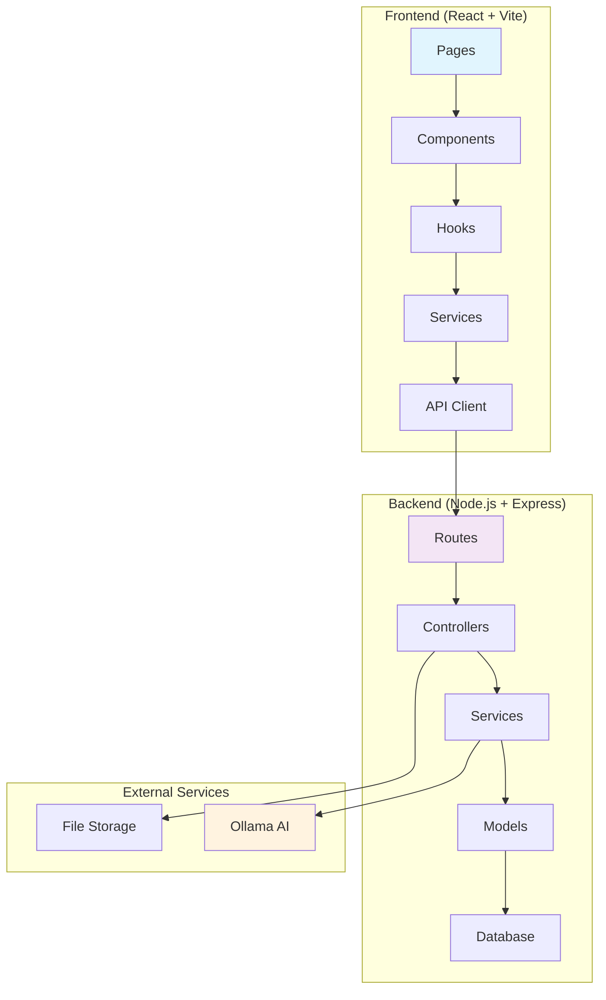
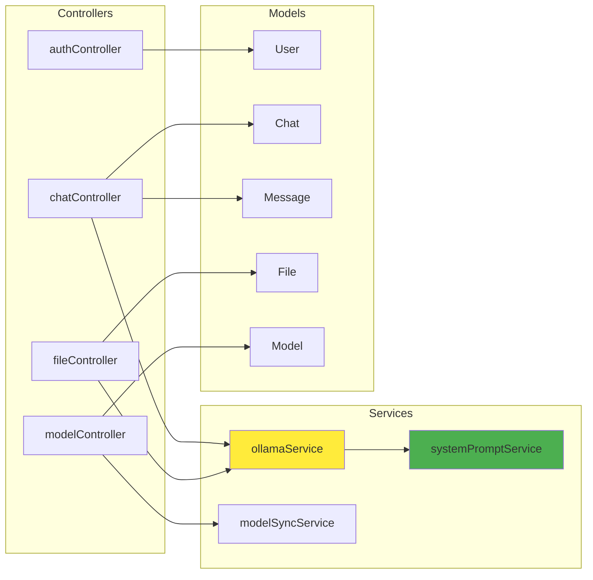
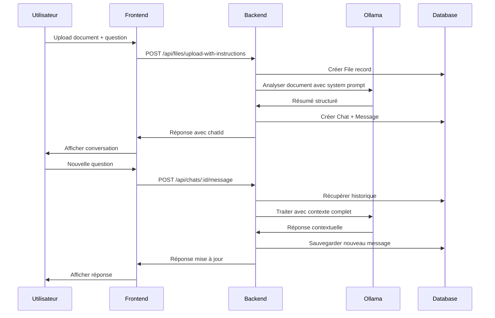
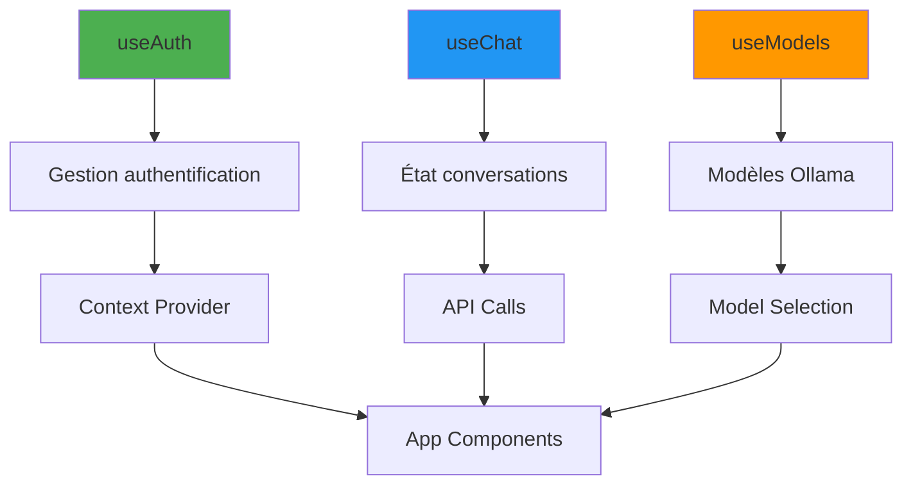

# ComplySummarize-IA

Une application web moderne pour l'analyse et la résumé de documents avec intelligence artificielle utilisant Ollama.

## 📋 Table des matières

- [Vue d'ensemble](#vue-densemble)
- [Architecture](#architecture)
- [Fonctionnalités](#fonctionnalités)
- [Installation](#installation)
- [Configuration](#configuration)
- [API Routes](#api-routes)
- [Structure du projet](#structure-du-projet)
- [Technologies utilisées](#technologies-utilisées)
- [Développement](#développement)
- [Déploiement](#déploiement)

## 🎯 Vue d'ensemble

ComplySummarize-IA est une application full-stack qui permet aux utilisateurs d'uploader des documents PDF et d'interagir avec eux via une interface de chat alimentée par l'IA. L'application utilise Ollama pour le traitement du langage naturel et offre une expérience conversationnelle avec mémoire contextuelle.

### Cas d'usage principaux
- 📄 Analyse et résumé automatique de documents
- 💬 Conversation interactive avec le contenu des documents
- 🔍 Extraction d'informations spécifiques
- 📊 Génération de rapports structurés
- 🔐 Gestion sécurisée des utilisateurs et des sessions

## 🏗️ Architecture

### Architecture générale



### Architecture Backend



### Flux de données - Conversation avec document



## ✨ Fonctionnalités

### 🔐 Authentification
- Inscription et connexion sécurisées
- Gestion des sessions avec JWT
- Cookies sécurisés avec expiration
- Middleware de protection des routes

### 📁 Gestion des fichiers
- Upload avec validation de taille et type
- Stockage sécurisé avec noms uniques
- Prévisualisation des fichiers

### 🤖 Intelligence Artificielle
- Intégration complète avec Ollama
- System prompts personnalisés en français
- Mémoire conversationnelle complète
- Sélection dynamique des modèles IA

### 💬 Interface de chat
- Interface moderne et responsive
- Messages en temps réel
- Historique des conversations
- Indicateurs visuels pour les fichiers
- Mode sombre/clair

### ⚙️ Gestion des modèles
- Synchronisation automatique avec Ollama
- Sélection de modèles en temps réel
- Gestion des modèles disponibles

## 🚀 Installation

### Prérequis

- **Node.js** >= 18.0.0
- **npm** >= 8.0.0
- **MYSQL** >= 8.0
- **Ollama** installé et configuré
- **Docker** (optionnel, pour le déploiement)

### Installation locale

1. **Cloner le repository**
```bash
git clone https://github.com/votre-username/ComplySummarize-IA.git
cd ComplySummarize-IA
```

2. **Installer les dépendances Backend**
```bash
cd backend
npm install
```

3. **Installer les dépendances Frontend**
```bash
cd ../frontend
npm install
```

4. **Configuration de la base de données**
```bash
# Créer la base de données MySQL
CREATE DATABASE complysummarize_db;

# Ou utiliser Docker
cd ../docker
docker-compose up -d
```

5. **Configuration des variables d'environnement**

Créer `.env` dans le dossier `backend/` :
```env
# Base de données
DB_HOST=localhost
DB_PORT=3306
DB_NAME=complysummarize_db
DB_USER=votre_user
DB_PASSWORD=votre_password

# JWT
JWT_SECRET=votre_jwt_secret_tres_securise

# Serveur
PORT=3001
NODE_ENV=development

# Ollama
OLLAMA_HOST=http://localhost:11434
DEFAULT_MODEL=llama3.2:latest

# Upload
MAX_FILE_SIZE=10485760
UPLOAD_DIR=./uploads
```

6. **Initialiser la base de données**
```bash
cd backend
npm run seed
```

7. **Démarrer les services**

Terminal 1 - Backend :
```bash
cd backend
npm run dev
```

Terminal 2 - Frontend :
```bash
cd frontend
npm run dev
```

Terminal 3 - Ollama :
```bash
ollama serve
ollama pull llama3.2:latest
```

8. **Accéder à l'application**
- Frontend : http://localhost:5173
- Backend API : http://localhost:3001
- Ollama : http://localhost:11434

## ⚙️ Configuration

### Configuration Ollama

1. **Installer Ollama**
```bash
# Linux/macOS
curl -fsSL https://ollama.ai/install.sh | sh

# Windows
# Télécharger depuis https://ollama.ai/download
```

2. **Modèles recommandés**
```bash
# Modèles légers (recommandés pour développement)
ollama pull llama3.2:latest
ollama pull mistral:latest
ollama pull codellama:latest

# Modèles plus performants (pour production)
ollama pull llama3.1:8b
ollama pull mixtral:8x7b
```

## 🛣️ API Routes

### Authentication Routes (`/api/auth`)

| Méthode | Endpoint | Description | Body |
|---------|----------|-------------|------|
| POST | `/register` | Inscription utilisateur | `{email, password, firstName, lastName}` |
| POST | `/login` | Connexion utilisateur | `{email, password}` |
| POST | `/logout` | Déconnexion | - |
| GET | `/me` | Profil utilisateur | - |

### Chat Routes (`/api/chats`)

| Méthode | Endpoint | Description | Body |
|---------|----------|-------------|------|
| GET | `/` | Liste des chats utilisateur | - |
| GET | `/:id` | Détails d'un chat | - |
| POST | `/:id/message` | Envoyer un message | `{content, instructions?}` |
| DELETE | `/:id` | Supprimer un chat | - |
| PUT | `/:id/archive` | Archiver un chat | - |

### File Routes (`/api/files`)

| Méthode | Endpoint | Description | Body |
|---------|----------|-------------|------|
| POST | `/upload` | Upload simple | `FormData {file}` |
| POST | `/upload-with-instructions` | Upload + analyse | `FormData {file, instructions}` |
| GET | `/:id` | Télécharger fichier | - |
| DELETE | `/:id` | Supprimer fichier | - |

### Model Routes (`/api/models`)

| Méthode | Endpoint | Description | Body |
|---------|----------|-------------|------|
| GET | `/` | Liste des modèles Ollama | - |
| POST | `/sync` | Synchroniser avec Ollama | - |
| GET | `/available` | Modèles disponibles | - |

### Skeleton Routes (`/api/skeletons`)

| Méthode | Endpoint | Description | Body |
|---------|----------|-------------|------|
| GET | `/` | Templates de prompts | - |
| POST | `/` | Créer template | `{name, template, description}` |
| PUT | `/:id` | Modifier template | `{name, template, description}` |
| DELETE | `/:id` | Supprimer template | - |

## 📁 Structure du projet

```
ComplySummarize-IA/
├── backend/                    # API Node.js/Express
│   ├── config/                 # Configuration DB
│   │   ├── authController.js   # Authentification
│   │   ├── chatController.js   # Gestion conversations
│   │   ├── fileController.js   # Upload/gestion fichiers
│   │   ├── modelController.js  # Gestion modèles IA
│   │   └── skeletonController.js # Templates prompts
│   ├── middlewares/            # Middlewares Express
│   │   └── auth.js            # Vérification JWT
│   ├── models/                # Modèles Sequelize
│   │   ├── User.js            # Utilisateurs
│   │   ├── Chat.js            # Conversations
│   │   ├── Message.js         # Messages
│   │   ├── File.js            # Fichiers
│   │   ├── Model.js           # Modèles IA
│   │   └── Skeleton.js        # Templates
│   ├── routes/                # Routes Express
│   ├── services/              # Services métier
│   │   ├── ollamaService.js   # Intégration Ollama
│   │   ├── systemPromptService.js # Prompts système
│   │   └── modelSyncService.js # Sync modèles
│   ├── uploads/               # Stockage fichiers
│   └── server.js              # Point d'entrée
├── frontend/                  # Application React
│   ├── src/
│   │   ├── components/        # Composants React
│   │   │   ├── Chat.jsx       # Interface chat
│   │   │   ├── Sidebar.jsx    # Barre latérale
│   │   │   ├── ModelSelector.jsx # Sélecteur modèles
│   │   │   ├── FileIndicator.jsx # Indicateur fichiers
│   │   │   └── ui/            # Composants UI
│   │   ├── hooks/             # Hooks React
│   │   │   ├── useAuth.jsx    # Authentification
│   │   │   ├── useChat.js     # Gestion chat
│   │   │   └── useModels.js   # Gestion modèles
│   │   ├── pages/             # Pages principales
│   │   │   ├── Login.jsx      # Connexion
│   │   │   ├── Register.jsx   # Inscription
│   │   │   ├── Conversation.jsx # Chat principal
│   │   │   └── Settings.jsx   # Paramètres
│   │   ├── services/          # Services API
│   │   │   ├── api.js         # Client API
│   │   │   └── authService.js # Service auth
│   │   └── routes/            # Routage React
│   └── public/                # Assets statiques
├── docker/                    # Configuration Docker
│   ├── docker-compose.yaml
│   └── init.sql/
└── README.md                  # Documentation
```

## 🛠️ Technologies utilisées

### Backend
- **Node.js** - Runtime JavaScript
- **Express.js** - Framework web
- **Sequelize** - ORM pour MySQL
- **MySQL** - Base de données relationnelle
- **JWT** - Authentification par tokens
- **Multer** - Upload de fichiers
- **bcrypt** - Hachage des mots de passe
- **Ollama** - Intégration IA locale

### Frontend
- **React 18** - Bibliothèque UI
- **Vite** - Build tool moderne
- **React Router** - Routage SPA
- **Tailwind CSS** - Framework CSS utility-first
- **React Icons** - Icônes
- **js-cookie** - Gestion des cookies
- **Axios** - Client HTTP

### DevOps & Tools
- **Docker** - Conteneurisation
- **ESLint** - Linting JavaScript
- **Prettier** - Formatage de code
- **PostCSS** - Traitement CSS

## 🔧 Développement

### Scripts disponibles

**Backend** (`backend/package.json`) :
```bash
npm run dev          # Démarrage développement avec nodemon
npm start           # Démarrage production
npm run seed        # Initialisation base de données
npm test           # Tests unitaires
```

**Frontend** (`frontend/package.json`) :
```bash
npm run dev        # Serveur de développement Vite
npm run build      # Build de production
npm run preview    # Prévisualisation du build
npm run lint       # Vérification ESLint
```

### Structure des hooks React



## 🚀 Déploiement

### Déploiement Docker

1. **Build des images**
```bash
# Backend
cd backend
docker build -t complysummarize-backend .

# Frontend
cd frontend
docker build -t complysummarize-frontend .
```

2. **Utiliser Docker Compose**
```bash
cd docker
docker-compose up -d
```

## 🔒 Sécurité

### Mesures implémentées
- ✅ Authentification JWT sécurisée
- ✅ Validation des entrées utilisateur
- ✅ Hachage des mots de passe avec bcrypt
- ✅ Cookies sécurisés avec expiration
- ✅ Validation des types de fichiers
- ✅ Sanitisation des noms de fichiers

## 📝 License

Ce projet est sous licence MIT. Voir le fichier `LICENSE` pour plus de détails.

---

**ComplySummarize-IA** - Transformez vos documents en conversations intelligentes ! 🚀
